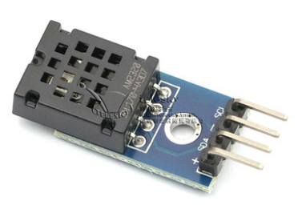

# AM2320
AM2320 Temperature Humidity Sensor Driver for TiJOS

| 条目         | 说明                          |
| ---------- | --------------------------- |
| 驱动名称       | AM2320数字温湿度传感器模块            |
| 适用         | 该驱动适用于AM2320系列温湿度传感器        |
| 通讯方式       | I2C                         |
| Java Class | TiAM2320.java               |
| 图片         |  |

